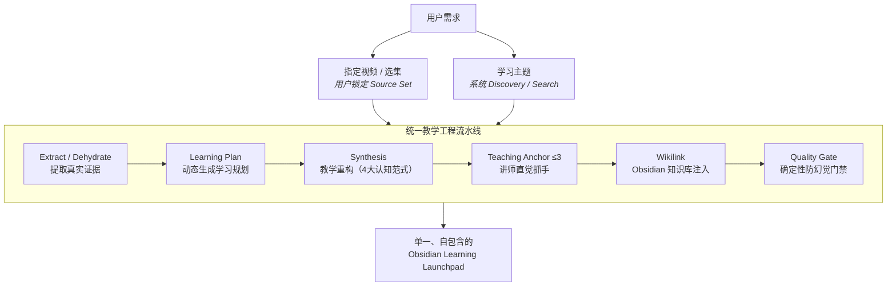

<div align="center">

# ⚒️ LearnForge (video2obsidian)

### **Turn Evidence into Real Learning.**

**不是总结视频。**  
**而是把视频证据，重构成真正能学、能练、能复习的 Obsidian 知识笔记。**

<br>

[](https://www.python.org/)
[](https://obsidian.md/)
[](#-生态位bilibili-first)
[](LICENSE)

</div>

---

## 🚨 你真的缺一个“视频总结器”吗？

一小时技术视频最常见的 AI 处理方式：
> 把字幕全部塞进大模型，得到一篇“首先……其次……最后……”的 500 字流水账。

但合上电脑，你发现自己依然：
- ❌ **做不出题**（考研 408 / 算法题遇到变形就懵）
- ❌ **写不出代码**（只知道名字，不知道底层怎么跑）
- ❌ **讲不清原理**（分不清相似概念，面试一问就露馅）
- ❌ **记不住陷阱**（踩坑时根本想不起视频里提过的警告）

**LearnForge 做的事情完全不同：**
> **它不总结“视频说了什么”，而是锻造“你怎么才能真正学会”。**

---

## ✨ 交付物长什么样？（直接看效果）

这是从 B 站计算机网络课程证据中，直接锻造出的 **Obsidian 原生笔记**：

> [!NOTE] 真实输出片段演示（直接在 Obsidian 中打开）
> 
> # TCP 拥塞控制：从网络雪崩到 AIMD 状态机
> 
> > 🎯 **通关目标**：亲手画出 cwnd / ssthresh 动态演变折线，并向他人讲清 Reno 快恢复机制。
> 
> ### 1. 直觉模型（心智抓手）
> > [!tip] 核心直觉
> > 流量控制管的是**“接收方的水桶有多大”**；  
> > 拥塞控制管的是**“整条公共马路是不是已经堵死”**。
> 
> ### 2. 讲师原声锚点（全篇仅保留最精辟的 ≤3 处直觉神髓）
> > [!quote] 🎙️ 原片讲师神比喻 · [03:45 - 04:02]
> > "流量控制管的是端到端水管粗细，拥塞控制管的是整条马路堵不堵。"
> 
> ### 3. 陷阱实验室（考试与面试必考坑）
> > [!danger] 常见认知死穴 ⚠️
> > - ❌ **高频误解**：收到 3 个重复 ACK 就判定网络彻底瘫痪，把 `cwnd` 盲目重置为 1。
> > - 🔥 **底层推演**：3 个 Dup ACK 代表后面的包还在源源不断到达，说明网络只是个别丢包。盲目归零会导致骨干网络吞吐急剧雪崩！
> > - ✅ **正确机制**：TCP Reno 触发 **快恢复 (Fast Recovery)**，只将 `ssthresh` 减半，`cwnd` 设为减半后的值开始线性加法增大。
> 
> ### 4. 闭环主动自测（合上笔记能回忆）
> > [!question] 主动召回检测
> > 1. 如果连续收到 3 个 Duplicate ACK，为什么不需要等待重传计时器超时？
> > <details>
> > <summary>🔍 点击展开自测解析与推导</summary>
> > 
> > **答案**：超时重传（RTO）意味着整条链路大概率丢包严重，代价极大；而 3 个 Dup ACK 恰恰证明后续 3 个报文顺利抵达了接收方，仅中间遗漏 1 个，因此可以不等超时直接触发快重传。
> > </details>

---

## 🥊 LearnForge 与普通 AI 视频总结的本质区别

| 维度 | 传统 AI 视频总结 | **LearnForge (video2obsidian)** |
|:---|:---|:---|
| **交付目标** | 500字读后感，合上就忘 | **可实操、可背诵、可检索的 Obsidian Launchpad** |
| **信源关系** | 仅单视频总结 | **双入口：单片精读 OR 针对主题跨视频综合** |
| **内容结构** | 时间轴流水账 | **现代教学架构（直觉模型 → 极简脚手架 → 机制演进 → 陷阱实验室）** |
| **讲师表达** | 全被 AI 洗成枯燥书面语 | **稀疏 Teaching Anchor（全篇 ≤3 处原话，锁定讲师神比喻）** |
| **真实性** | 容易发生幻觉、乱造名词 | **秒级时间戳骨干溯源 + 原片 Transcript 机械强校验** |
| **知识网络** | 孤立 Markdown 散落在桌面 | **Obsidian 原生双链（自动与已有知识库做存在性校验）** |
| **复习闭环** | 被动阅读 | **Active Recall 闭环自测 + 折叠答案 + 验证微任务** |

---

## 💡 它是怎么工作的？（双入口，同一套流水线）

你可以从两个入口开始：

```text
① 我有视频 ──────────> [锁定单片/多P证据] ─┐
  “帮我精读这个 B 站视频”                   │
                                          ├──> [证据提取/脱水] ──> [教学重构] ──> [Obsidian 笔记]
② 我有目标 ──────────> [全网搜寻互补证据] ─┘
  “我要彻底搞懂 Raft”
```

<details>
<summary>📐 点击查看完整底层工程时序图 (Mermaid)</summary>


</details>

---

## 🧭 我该如何使用？（选择适合你的姿势）

不论你手头有没有开发环境，都可以立刻用起来：

### 模式 A：零配置体验（适合普通用户 / 今晚就能用）
> **无需安装 Python，无需显卡，任何手机/电脑均可。**

1. 打开 [core/teaching_base.md](core/teaching_base.md) 复制其中的教学规范；
2. 配合网页端 AI（如 Claude 3.5 Sonnet / DeepSeek-V3 / Kimi / ChatGPT）；
3. 将 B 站视频自带字幕或课程文稿贴入，输入：“*请按规范重构成 Obsidian 学习笔记*”；
4. 瞬间获得结构化 Callout 与陷阱题，直接粘贴进 Obsidian！

---

### 模式 B：AI Agent 技能模式（推荐 ⭐⭐⭐⭐⭐）
> **配合 Claude Code、Antigravity CLI 或 Cline 使用。**

作为专业技能挂载后，你只需要在聊天框对 Agent 说一句人话：

```text
“帮我深度精读这个视频：https://www.bilibili.com/video/BV1xx411c7mD”
“我要彻底搞懂 Raft 算法，帮我找视频证据整理进 Obsidian。”
```

**挂载方法**（以 Claude Code / Antigravity 为例）：
```bash
# 方式 1：直接克隆到技能目录
git clone https://github.com/zekcjshe/LearnForge-skill.git "$HOME/.claude/skills/video2obsidian"

# 方式 2：或者 Windows PowerShell 软链接：
New-Item -ItemType Junction -Path "$HOME\.claude\skills\video2obsidian" -Target "E:\LearnForge-skill"
```

---

### 模式 C：本地 CLI 引擎模式（极客与开发者）
> **本地自动化拉取 B 站音频、离线 Whisper 转录、知识库双链注入。**

#### 1. 极速安装
```bash
git clone https://github.com/zekcjshe/LearnForge-skill.git
cd LearnForge-skill
pip install -r requirements.txt
```

> [!TIP] 💡 90% 的视频不需要显卡！
> - **优先复用字幕**：B 站带字幕的视频无需跑语音模型，3 秒即可完成证据提取。
> - **CPU 即可轻快运行**：即便没有字幕，内置的 `faster-whisper` 基于 CTranslate2 引擎，在普通轻薄本 CPU 上也能轻快运行，完全无需安装庞大笨重的 GPU / PyTorch 环境。

#### 2. 常用命令行一览
```bash
# ① 快速获取分块指纹索引（毫秒级查看视频结构）
python extract.py "https://www.bilibili.com/video/BV1..." --chunk-index

# ② 提取指定第 1, 3 分块的核心证据并过滤口水词
python extract.py "https://www.bilibili.com/video/BV1..." --chunks 1,3 --evidence -o evidence.json

# ③ 将已有知识库的双链安全注入到 Markdown 中
python wikify.py all --vault "D:/MyVault" --terms terms.json --input draft.md --output final.md

# ④ 运行确定性防幻觉门禁（检查时间戳、原话真实性与自测题闭环）
python validate_note.py final.md --vault "D:/MyVault"
```

---

## 🛠️ 深度工程架构（为什么它不幻觉、省算力？）

<details>
<summary><b>🔍 点击展开：4 大核心认知范型 (Exemplars)</b></summary>

LearnForge 不按“学科”死板套模板，而是按**人类理解知识的认知模式**组织：

- `mechanism.md`：**机制时序型**（网络协议、TCP、操作系统调度、状态机流转）
- `problem_solving.md`：**算法优化型**（动态规划、二分查找、空间压缩、回溯搜索）
- `formal_security.md`：**形式证明型**（密码学、RSA、零知识证明、威胁模型分析）
- `system_architecture.md`：**系统权衡型**（分布式一致性、存储引擎、方案 Trade-off）

无论是考研 408、LeetCode 刷题还是系统设计，都能自动匹配最佳教学心智模型。
</details>

<details>
<summary><b>🔍 点击展开：分层 Token Funnel（按需取证节省 85%+ 算力）</b></summary>

面对动辄 1~2 小时的长视频，不盲目全量喂给大模型：
1. **L0 Navigation**：字幕快车道秒级拉取 / 原生分 P 章节提取；
2. **L0.5 Scout**：针对无字幕视频，各切片仅采样 20 秒音频粗侦察；
3. **L1 Target Chunks**：仅转录命中学习规划的核心切片；
4. **L1.5 Evidence**：代码、定理与技术关键句提炼，过滤讲师口水词；
5. **L2 Synthesis**：仅给大模型提供高浓度核心证据，生成精炼笔记。
</details>

<details>
<summary><b>🔍 点击展开：Teaching Anchor 三问筛选机制（拒绝 AI 洗稿腔）</b></summary>

AI 往往把名师的“神级比喻”洗成枯燥术语。LearnForge 实行严格的讲师原话筛选：
- **Q1 不可替换？**（AI 改写后是否丢失了通俗比喻与记忆抓手？）
- **Q2 不可推导？**（该直觉是否属于正文公式尚未交代的心智模型？）
- **Q3 一周后可记忆？**（学习者一周后是否仍能通过这句话唤醒整个知识点？）

**铁律**：全篇硬上限 ≤ 3 条（宁缺毋滥），单条 ≤ 50 字，并通过 transcript 机械比对，彻底杜绝模型胡编乱造。
</details>

<details>
<summary><b>🔍 点击展开：Obsidian 双链安全注入与消歧</b></summary>

- **真存在性检查**：严格索引你的 Vault 目录，只有真实存在的概念笔记才会被连成双链；
- **同名消歧**：遇到多个同名文件时不胡乱链接，支持相对路径消歧；
- **保护区隔离**：代码块、公式块、已有链接区绝对不破坏，多次运行保持幂等。
</details>

---

## 🎯 生态位：Bilibili First

当前优先深度适配 **Bilibili**：
- 结合 `bilibili` MCP 工具链，实现高赞视频、播放列表、分 P 选集毫秒级发现；
- **国内高速镜像直连**：默认优先从 ModelScope 拉取模型，阿里公共 DNS 钉扎真实 IP，彻底防御代理 Fake-IP 劫持；
- **兼容全格式**：不仅支持 Bilibili，亦原生支持 YouTube、本地录音与视频（`.mp4`、`.m4a`、`.mp3`、`.wav`）。

---

## 📌 单元与回归测试基准

本项目采用确定性回归测试套件保护核心链路稳定性：
```bash
python -m unittest tests/test_regression.py
# Ran 20 tests in 0.130s ... OK (100% 通过)
```
涵盖复杂度正则检测、重叠保护区并集计算、分块归档合法性、Whisper 离线模型加载机制等关键用例。

---

## 📄 开源许可证

本项目基于 [MIT License](LICENSE) 开源。欢迎提交 Issue 与 PR，一起让知识回归真正能学会的样子！
