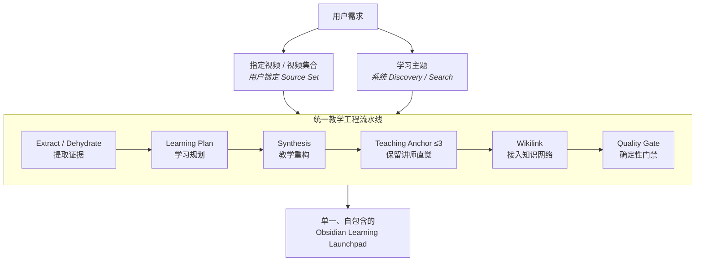

<div align="center">

# ⚒️ LearnForge (video2obsidian)

### **Turn Evidence into Real Learning.**

**不是总结视频。**  
**而是把视频证据，重构成真正能学、能练、能复习的 Obsidian 知识笔记。**

<br>

[](https://www.python.org/)
[](https://obsidian.md/)
[](#-核心工程三分层-token-funnel)
[](#-生态位bilibili-first)
[](LICENSE)

</div>

---

## 🚨 你真的缺一个“视频总结器”吗？

一小时视频最常见的 AI 处理方式是什么？

> 把字幕全部塞进大模型。  
> 然后得到一篇“首先……其次……最后……”的 500 字总结。

问题是：

**总结完了，你真的学会了吗？**

你可能依然：
- 不会做题
- 写不出代码
- 讲不清原理
- 分不清相似概念
- 记不住关键陷阱
- 更不知道下一步该练什么

**LearnForge 做的事情完全不同：**

> **它不是把视频“说过什么”压缩一下。**  
> **它把视频里的证据，重构成“你应该怎么学”。**

---

# ⚡ 一句话看懂 LearnForge

你可以从两个入口开始：

```text
① 我有视频
   “帮我精读这个 B 站视频。”

② 我有目标
   “我要彻底搞懂 Raft。”
```

两种入口只有一个地方不同：

> **Source Set 怎么得到。**

之后全部进入**同一条教学工程流水线**。



> **双入口，不是两套系统。**  
> 指定视频和主题学习只有 Discovery 不同；进入 Source Set 后，Extract、Evidence、Synthesis、Teaching Anchor、Wikilink、Validate 全部共享。

---

# 🎯 入口一：我有视频，你帮我真正学懂

你可以直接给一个 B 站视频：
> “帮我深度精读这个视频：https://www.bilibili.com/video/BVxxxx”

也可以给本地课程录音 / 视频：
> “帮我分析这节课：`D:/lectures/distributed_systems.mp4`”

系统不会简单地：
```text
视频 → 字幕 → 总结流水账
```

而是：
```text
指定 Source Set
      ↓
Extract / Dehydrate
      ↓
Learning Plan
      ↓
Teaching Synthesis
      ↓
Teaching Anchor
      ↓
Wikilink
      ↓
Quality Gate
      ↓
Obsidian Learning Launchpad
```

尤其对于你已经整理得很好的课程笔记，系统的目标不是“推倒重写”，而是：

> **保留原有强结构，在真正相关的位置做稀疏增强。**

---

# 🧠 入口二：我要学 X，让系统帮我找证据

例如：
> **“我要彻底搞懂 TCP 拥塞控制，帮我整理进 Obsidian。”**

系统从学习目标出发：
```text
Learning Goal
      ↓
Knowledge Checklist
      ↓
Discovery / Search
      ↓
互补 Source Set
      ↓
证据覆盖与缺口补齐
      ↓
Teaching Synthesis
      ↓
Learning Launchpad
```

例如动态生成的自适应规划：

```yaml
topic: "TCP 拥塞控制"
primary_exemplar: "mechanism"                  # 机制/时序主轴
secondary_exemplars:
  - "system_architecture"                      # 架构权衡（嵌入式融合）
integration_strategy:
  type: "embedded"

must_cover:
  - "拥塞控制 vs 流量控制本质区别"
  - "Slow Start 指数增长"
  - "AIMD 加法增大乘法减小"
  - "Fast Retransmit 与 3 个重复 ACK"
  - "Fast Recovery 与 Tahoe / Reno 状态机对比"

preferred_evidence:
  - "状态机时序图"
  - "cwnd 演变曲线"
  - "Wireshark 抓包报文"

avoid:
  - "冗长历史八卦"
  - "纯文本复读 RFC"
```

这里的核心不是“搜到几个视频”，而是：

> **先知道你要学什么，再去找能补齐这些知识缺口的证据。**

---

# ✨ 最终交付的，不是一篇总结

最终的学习笔记不是：
> “UP 主首先介绍了拥塞控制，然后介绍了慢开始，最后介绍了 Reno……”

而是围绕学习者认知路径重构的自包含文档：

```markdown
# TCP 拥塞控制：从网络雪崩到 AIMD 状态机

> 🎯 全篇通关目标：
> 能够亲手画出 cwnd / ssthresh 动态演变折线，
> 并讲清 Tahoe 与 Reno 在快恢复分支上的本质差异。

## 模块一：为什么需要拥塞控制？
> 🎥 来源原片：视频 A [02:15–08:40] · UP主 计算机网络精讲

> [!tip] 直觉与心智模型
> 流量控制管的是“接收方水桶有多大”；
> 拥塞控制管的是“整条马路是不是已经堵死”。

> [!quote] 🎙️ 原片教学锚点（UP主）
> "流量控制管的是端到端水管粗细，拥塞控制管的是整条马路堵不堵。"
> —— [03:45 - 04:02]

...

> [!danger] 陷阱实验室 ⚠️
> ❌ 常见误解：收到 3 个 Dup ACK 就判定严重拥塞并降回 cwnd=1
> 🔥 底层推演：推导为什么这只代表个别报文丢包，盲目归零会导致骨干网络吞吐急剧雪崩
> ✅ 正确机制：Reno 进入 Fast Recovery，仅将 cwnd 减半

...

> [!question] 闭环主动自测 📝
> 1. （概念本质）ssthresh 在慢开始与拥塞避免之间扮演什么角色？
> <details><summary>🔍 点击展开自测答案与解析</summary>
> 答案：......
> </details>
```

最终笔记围绕的是：

> **目标 → 直觉 → 机制 → 推导 → 代码/模型 → 陷阱 → 自测 → 复习**

而不是“视频从头讲到尾”。

---

# 🥊 LearnForge 到底和普通 AI 视频总结差在哪？

| 维度 | 传统 AI 视频总结 | **LearnForge (video2obsidian)** |
|:---|:---|:---|
| **产品定位** | 视频摘要流水账 | **可掌握的自包含学习系统** |
| **输入模式** | URL → 总结这 1 个视频 | **视频 / 学习目标 → 确定性 Source Set** |
| **信源关系** | 仅支持单点孤立视频 | **指定视频精读 + 主题学习横向多源互补** |
| **内容组织** | “首先、其次、最后”流水账 | **资深教学架构（直觉 → 脚手架 → 演进 → 陷阱）** |
| **Token 策略** | 全片字幕一股脑灌模型 | **分层 Token Funnel 按需精准取证** |
| **讲师表达** | AI 语言全量重写，丢失口吻 | **稀疏 Teaching Anchor（全篇 ≤3 条原话，保留直觉神髓）** |
| **来源真实性** | 主要靠大模型自觉，易幻觉 | **Grounded Evidence + Transcript 机械溯源校验** |
| **知识网络** | 孤立 Markdown 堆积 | **Obsidian 原生知识网络（增量索引 + 存在性校验 + 消歧）** |
| **学习闭环** | 被动走马观花，合上电脑就忘 | **Active Recall 自测 + 折叠答案 + 微任务闭环** |

---

# 🧩 核心工程一：Learning Plan + 4 大认知 Exemplar

LearnForge 不再按：
> “算法一套规则、网络一套规则、密码学一套规则……”

无限堆学科模板，而是采用：

> **通用教学五项铁律 + 来源可溯性 + 动态 Learning Plan + 4 大认知 Exemplar**

```text
core/
├── teaching_base.md        # 通用教学五项铁律（直觉先于抽象、双重锚定、脚手架、陷阱实验室、主动回忆）
├── provenance.md           # 来源可溯性规范（模块级主干出处 + 核心结论时间戳 + 行级三元标签）
├── learning_plan_schema.md # 动态学习规划标准（指定主辅 Exemplar 与必掌握清单）
└── topic_synthesis.md      # 多源主题综合规则（Coverage, Alternative, Comparison, Progression）

profiles/exemplars/         # 4 大认知范例库（按人类认知思维模式抽象，而非按学科划分）
├── mechanism.md            # 机制/协议时序型（网络协议、OS调度、状态机流动）
├── problem_solving.md      # 算法/状态优化型（DP递推、搜索回溯、空间压缩）
├── formal_security.md      # 形式安全/数学证明型（RSA、零知识证明、威胁模型）
└── system_architecture.md  # 系统架构/权衡型（存储引擎、分布式一致性、方案 Trade-off）
```

### 为什么这样设计？
因为：
- **TCP 和 Raft 都可以是“机制问题”**；
- **0-1 背包和搜索都可以是“问题求解问题”**。

真正决定教学方式的，不一定是“学科”，而是：**这个知识该怎么被人理解。**

---

# 🎙️ 核心工程二：Teaching Anchor

AI 最擅长整理结构，但 AI 有一个天然副作用：
> **它太容易把老师讲课时那些真正有记忆价值的独特表达、神级比喻一起洗掉。**

所以 LearnForge 建立极稀缺的“双声道”：
```text
AI 正文
= 负责结构化、推导、补全

Teaching Anchor
= 负责保留原讲师的直觉抓手
```

但不是随便摘金句。每个候选都必须通过严格的“三问筛选”：
```text
Q1 不可替换？（改写成 AI 语言是否损失比喻/语气/记忆点）
    ↓
Q2 不可推导？（AI 正文是否尚未严密推导出该直觉）
    ↓
Q3 可记忆？（一周后学习者是否还能清晰记住这句话）
```

三问全部通过，才有资格进入全局排序：
- **全篇硬上限 ≤ 3 条，允许 0 条**（宁缺毋滥）；
- 单条字数 ≤ 50 字；
- 旁路生成 `anchor_audit.json`，记录逐项文字淘汰理由；
- 门禁工具执行原始 transcript 机械校验，彻底杜绝编造原话。

---

# ⚡ 核心工程三：分层 Token Funnel

面对 1～2 小时技术视频，不直接把全文灌进模型，而是逐层缩小：

```text
原始视频（1~2 小时音频/视频）
   ↓
┌──────────────────────────────────────────────┐
│ L0  Navigation                               │
│ 字幕快车道秒级抓取 / 视频内嵌 Chapters 映射  │
└──────────────────────┬───────────────────────┘
                       ↓ (无字幕且无内嵌章节时)
┌──────────────────────────────────────────────┐
│ L0.5 Scout                                   │
│ 复用音频缓存，各切片仅采样 20s 做极速粗侦察  │
└──────────────────────┬───────────────────────┘
                       ↓
┌──────────────────────────────────────────────┐
│ L1 Target Chunks                             │
│ 仅转录 Learning Plan 命中的核心章节切片      │
└──────────────────────┬───────────────────────┘
                       ↓
┌──────────────────────────────────────────────┐
│ L1.5 Evidence                                │
│ 过滤过渡口水词，提炼核心定理、代码与陷阱原句 │
└──────────────────────┬───────────────────────┘
                       ↓
┌──────────────────────────────────────────────┐
│ L2 Synthesis                                 │
│ 以最小必要证据，重构成单一自包含笔记终稿     │
└──────────────────────────────────────────────┘
```

核心原则：**不是“模型看得越多越聪明”，而是“给模型刚好够用的证据”。**

---

# 🔗 核心工程四：Grounded + Obsidian Native

LearnForge 不只是生成 Markdown，更保证知识能无缝进入已有知识网络。

### 来源真实性
正文严格采用骨干来源锚点与行级三元标签：
```text
[🎥 原片]      讲师权威事实与关键结论（带秒级时间戳，如 [03:45] 或 ?t=225）
[📎 补充推导]  针对跳步处由 AI 补充的数学证明与状态转移表
[⚠️ 教学解释]  为降低门槛引入的生活直觉类比，防误作为学术定义
```

### Wikilink 安全接入
Wikilink 通过真实 Vault 索引进行安全校验：
```text
术语候选 (LLM 提取)
        ↓
Vault 索引真实存在性检查（支持相对路径、别名与文件名回退）
        ↓
歧义消歧防护（多目标时不乱链）
        ↓
幂等注入（保护区隔离，每次独立生成）
```

因此不是“AI 觉得这个节点应该存在”，而是：**“这个节点真的存在于你的 Vault 中”。**

---

# 🧭 核心输出：Learning Launchpad

最终产物不是一篇孤立散落的摘要，而是一份可以直接打开开始学习的 **Obsidian Learning Launchpad**：

```text
🎯 Pre-test（前置知识激活）
      ↓
🎯 Grounded Goal（全篇通关目标）
      ↓
📖 Teaching Content（直觉模型 → 极简脚手架 → 机制演进 → 陷阱实验室）
      ↓
🧠 Post-test（闭环自测练习，带折叠答案）
      ↓
🃏 Recall Cards（核心记忆卡）
      ↓
🚀 Verifiable Micro-task（可验证代码/抓包微任务）
```

长期复习、Anki、代码编译运行等工作继续交给你习惯的工具：

> **LearnForge 负责把“看视频”变成“真正进入学习状态”。**

---

# 🎯 生态位：Bilibili First

LearnForge 不假装自己已经是“万能视频知识搜索器”。

当前产品明确：**Bilibili First**。
- 重点配合 `bilibili` MCP，实现高赞技术教程、分 P 选集与章节目录的毫秒级发现；
- 模型下载智能双路由：默认优先从 ModelScope 国内源拉取 Faster-Whisper 模型，并使用阿里公共 DNS 钉扎真实 IP 彻底抵御代理 Fake-IP 劫持；海外或离线环境可通过 `--model-source hf` 直连 HuggingFace；
- 底层 Extractor 基于 `yt-dlp` 与原生 `wave/ffmpeg` 解耦设计，天然具备 Bilibili、YouTube 以及本地音视频文件（`.mp4`、`.m4a`、`.mp3`、`.wav`）的通用提取能力。

---

# 🚀 快速上手

## 1. 安装

确保本地已安装 Python 3.10+ 与 `ffmpeg`（或通过 `pip install imageio-ffmpeg`）：

```bash
git clone https://github.com/learnforge/video2obsidian.git
cd video2obsidian
pip install -r requirements.txt
```

> [!TIP] 可选 PyTorch 加速支持
> 基础转录与脱水仅需 `faster-whisper`（基于 CTranslate2，无需安装臃肿的 PyTorch 即可在 CPU/CUDA 上轻量运行）。若希望在 GPU 显存 OOM 时获得更平滑的主动清空与回退，可按需选装对应 CUDA 版本的 PyTorch：`pip install torch`。

若作为 Agent Skill 使用（例如 Claude Code / Antigravity / Cline），只需将本目录添加至技能路径：

```bash
# Windows PowerShell 软链接示例：
New-Item -ItemType Junction -Path "$HOME\.claude\skills\video2obsidian" -Target "D:\path\to\video2obsidian"
```

---

## 2. 直接对 AI 说人话

### 🎯 主题学习
> “我要搞懂 Raft 分布式一致性算法，帮我从视频找证据整理进 Obsidian。”

### 🎥 指定视频
> “帮我深度精读这个视频：https://www.bilibili.com/video/BV1xx411c7mD”

### 🎙️ 本地课程录音/视频
> “帮我分析这节课：`D:/lectures/operating_systems_03.mp4`”

不需要记忆复杂 CLI。

**你负责表达你要学什么。**  
**LearnForge 负责处理后面的证据提取、教学重构与知识库工程。**

---

# 🛠️ 开发者底层工具接口 (Developer Architecture)

如果你希望直接调用底层确定性工具：

### 1. 生成视频分块技术指纹索引（毫秒级 L0 导航）
```bash
python extract.py "https://www.bilibili.com/video/BV1..." --chunk-index
```

### 2. 仅提取指定分块并执行 L1.5 证据提炼
```bash
python extract.py "https://www.bilibili.com/video/BV1..." \
  --chunks 1,3 \
  --evidence \
  --domain-prompt "Raft, Quorum, Term" \
  --json \
  -o ./out/evidence.json
```

### 3. 对 Markdown 执行 Wikilinks 幂等注入
```bash
python wikify.py all \
  --vault "D:/MyVault" \
  --terms terms.json \
  --input draft.md \
  --output note.md \
  --weak-links footer
```

### 4. 执行确定性教学质量门禁审计
```bash
python validate_note.py note.md \
  --vault "D:/MyVault" \
  --archive ./out/evidence_archive.json
```

---

# 📋 `terms.json` 契约

Agent 与 `wikify.py` 之间的术语交互遵循标准化格式：

```json
[
  {
    "term": "慢开始",
    "type": "algorithm",
    "target": "计算机网络/TCP拥塞控制.md"
  },
  {
    "term": "AIMD",
    "type": "concept"
  }
]
```
- `term` (必填): 待链接的核心术语。
- `type` (可选): `concept` | `algorithm` | `technique` | `data-structure`。
- `target` (可选): 指定 Vault 中的真实目标笔记 stem 或相对路径，用于解决同名笔记歧义。

---

# 📌 Golden Demo / 验证基准

LearnForge 的验证不是只看“模型生成了一篇文章”，而是通过确定性门禁进行三类标杆验证：

```text
指定视频模式
│
├── 动态规划全景通关
│   └── 验证自包含 Target Form + 极限脱水能力
│
└── 0-1 背包
    └── 验证 Teaching Anchor 规则 + Transcript 溯源防编造校验

主题学习模式
│
└── Raft
    └── 验证动态 Learning Plan + 机制与系统架构 Exemplar 嵌入式融合
```

---

# 🧠 最后一句

普通视频 AI 在回答：

> **“这个视频讲了什么？”**

LearnForge 想回答的是：

> **“看完这些证据之后，我到底应该学会什么，以及我要怎么真正学会它？”**

**Turn Evidence into Real Learning.  
Build Knowledge. Make it Yours.**

---

## 📄 开源许可证

本项目基于 [MIT License](LICENSE) 开源。欢迎提交 PR、分享你用 LearnForge 构建的优质知识库！
